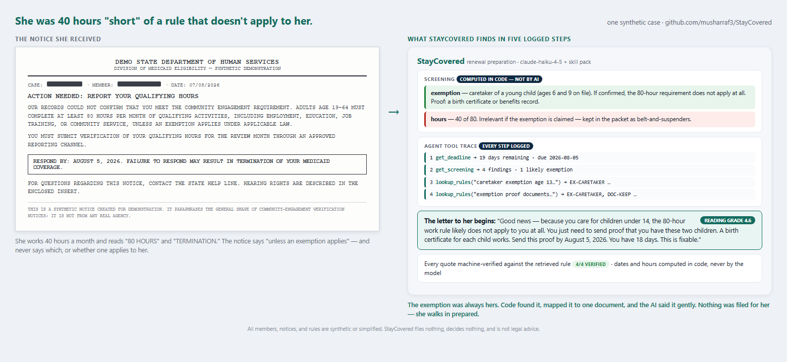
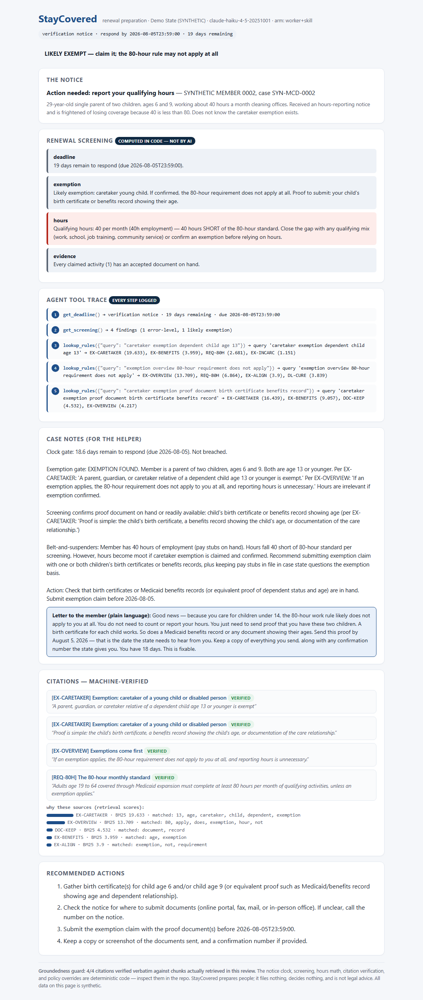

# StayCovered — a glass-box renewal-preparation assistant for Medicaid work requirements

**Helps people comply with the new community-engagement rules and keep coverage they are legally entitled to: deterministic code screens for exemptions, adds up qualifying hours, maps every claim to its proof document, and runs the deadline clock — an auditable AI agent explains the result at a 6th-grade reading level, with every step logged and every quote machine-verified.**

Built with Claude (`claude-fable-5` as teacher, `claude-haiku-4-5` as worker) · 100% Python standard library · MIT

---

## The problem

Federal Medicaid work requirements are rolling out now — statewide programs began in 2026, with national implementation required by January 2027 and six-month renewals behind them. The Congressional Budget Office projects millions will lose coverage; the evidence says most of those losses will be **procedural, not substantive**. In Arkansas's 2018 program — the only real-world precedent — about 18,000 people lost coverage in months, and subsequent research found most of them either already met the requirement or qualified for an exemption. They lost coverage because nobody translated the notice, nobody told them they were exempt, and nobody told them which document would prove it.

The state tells you THAT you must prove something. Nothing tells you HOW. That gap sits entirely on the member's side — which means software can actually fill it.



## What this tool is — and is not

StayCovered **prepares the person, not the paperwork system**. It reads the notice, screens for exemptions, does the hours math, builds the document checklist, and writes a plain-language letter about what to gather and when it is due. It never interacts with any government system, files nothing, decides nothing, and gives no legal advice. Think of the posture as TurboTax's: the IRS is unchanged; the person walks in prepared.

It is deliberately neutral on policy. The requirements are the law; losing coverage you are *entitled to keep* over paperwork helps no one — not the member, not the state (which carries churn and reprocessing costs; federal rules even require states to attempt data-matching before asking anyone for proof), and not Medicaid managed-care plans (which lose members procedurally and get them back sicker). The only villain in this repository is complexity.

## Why "glass box" — the architecture in one paragraph

The highest-stakes work is deterministic (`staycovered/checks.py`): an **exemption screen** over the federal catalog (caretaker of a young child, medically frail, pregnancy, disability benefits, SNAP/TANF alignment, and more — each with its proof document), **hours math** against the 80-hour standard, **evidence mapping** from each claimed activity to the documents that satisfy it, the **deadline clock** including the 30-day cure period and the 90-day reconsideration window most people never learn exists, and **barrier flags** (returned mail, no internet, language) that predict procedural coverage loss. The model reaches the rulebook, the clock, and the screening only through logged tool calls; citations must quote retrieved passages verbatim and are machine-verified (`staycovered/grounding.py`); and the code policy layer (`staycovered/pipeline.py`) errs only toward *more help* — a passed deadline always routes to a free human navigator, and a likely exemption can never be silently dropped.

## The economics, with a budget twist

Same teacher/worker bet as the rest of this series ([#2 ClearAnswer](https://github.com/musharraf3/clearanswer), [#3 RightCall](https://github.com/musharraf3/rightcall)): Claude Fable 5 authored the skill pack once ([`skills/renewal-prep.md`](skills/renewal-prep.md)); Haiku 4.5 executes it. New this time: the expensive teacher arm runs as a small **spot-check** of the quality ceiling instead of the full suite — sample the ceiling, don't pay for it everywhere. (This run: 2 cases, because the API account ran out of credits mid-run — which is its own kind of budget discipline.) Results from live API runs are committed in [`evals/results.md`](evals/results.md).

| Arm | Model | Cases |
|---|---|---|
| `worker` | Haiku 4.5 + tools | all 10 |
| `worker+skill` | Haiku 4.5 + tools + Fable 5's skill pack | all 10 |
| `teacher+skill` | Fable 5 (spot-check) | 2 |

**July 2026 run:** both worker arms scored 9/10 on raw decisions with 97–100% citation groundedness and member letters at a **5.1 average reading grade** (target ≤ 7); the teacher spot-check was perfect on both sampled cases at grade 4.7. Total spend for the entire eval program: **about $0.77** — and the one decision "miss" is kept honest in the gold labels: on the case with hours met but five days left, no internet, and bounced mail, both models chose extra caution (act/refer) over my labeled `ready_to_submit`. Reasonable people can disagree with my label; the miss stays.

## What a case looks like

`case_02` — the single parent of a 6- and a 9-year-old, working 40 hours a month and terrified of the 80-hour rule she doesn't actually have to meet. Code finds the caretaker exemption; the agent pulls the clock, the screening, and the rulebook through logged tools; the letter starts with "Good news":



## Quickstart

```bash
git clone https://github.com/musharraf3/staycovered.git
cd staycovered

# Offline demo (no key, no installs — replays real API runs, tool traces included):
python -m staycovered review --case examples/cases/case_02.json --offline

# Glass-box HTML report:
python -m staycovered report --case examples/cases/case_02.json --offline

# Live mode + evals (urllib only — zero dependencies):
export ANTHROPIC_API_KEY=sk-ant-...
python evals/run_evals.py
```

## What the demo cases cover

Ten synthetic people, modeled on how procedural coverage loss actually happens: the single parent who doesn't know the caretaker exemption exists; the house cleaner paid in cash who believes her 90 real hours "don't count"; the line cook whose renewal went to an old address and who doesn't know about the 90-day reconsideration window; the person in substance-use treatment afraid to report zero hours; the janitor with five days left, no internet, and bounced mail; the member relying on an exemption the facts don't support. Plus the calm cases — hours met, proof in hand — where the right answer is simply "you're ready; here's the envelope."

## Responsible use

Every member, notice, and rule summary in this repository is synthetic or simplified for demonstration. StayCovered is not legal advice, files nothing with any agency, and cannot guarantee outcomes; the state's own determination and appeal rights always govern. If this affects you in real life: your state Medicaid agency, a certified navigator, a legal-aid office, or the Medicaid ombudsman provide free, real help. See [DISCLAIMER.md](DISCLAIMER.md).

## Author

**Musharraf Shaikh** — healthcare data professional writing about transparent AI for US healthcare. [LinkedIn](https://www.linkedin.com/in/musharraf-shaikh/)

Weekend Builds in Healthcare AI · #4 (see [#1 FirstPass](https://github.com/musharraf3/firstpass-prior-auth) · [#2 ClearAnswer](https://github.com/musharraf3/clearanswer) · [#3 RightCall](https://github.com/musharraf3/rightcall)). Built with Claude Fable 5 in Claude Cowork.

*Personal project. Views and code are my own — not affiliated with, endorsed by, or based on any employer's data, processes, or systems.*

MIT License — see [LICENSE](LICENSE).
